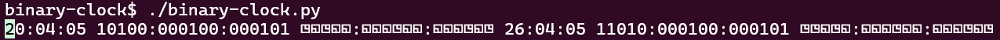
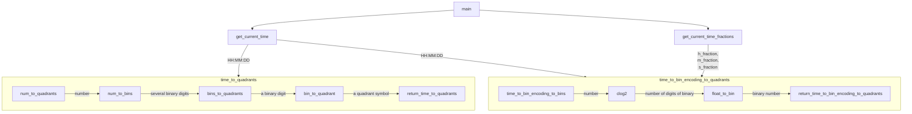
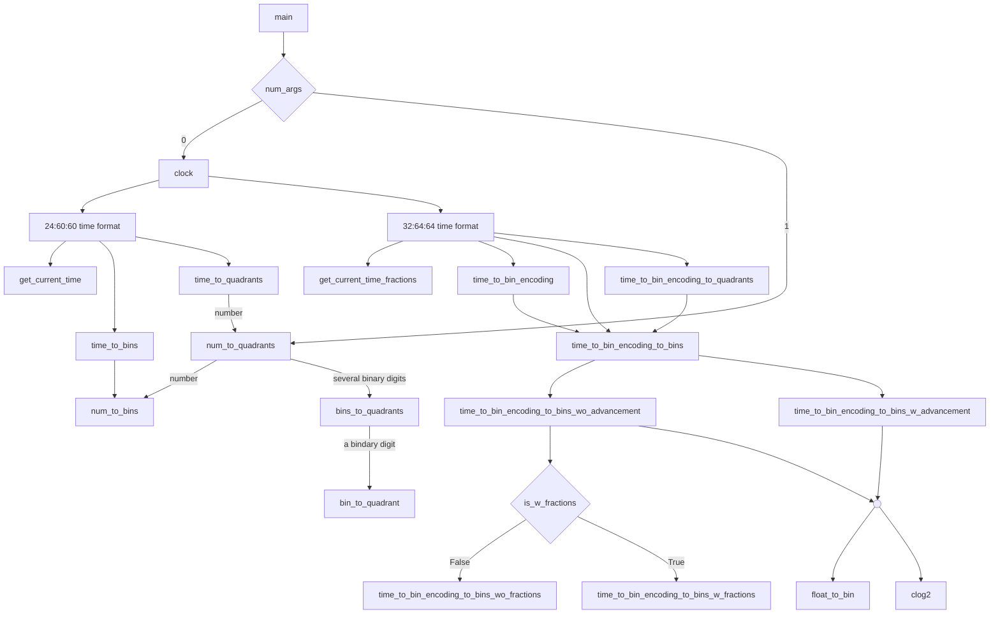

# binary-clock
Binary clock with 32:64:64 time format, with quadrant symbols

## Description
Available output time formats: 24:60:60 time format, 32:64:64 time format  
Available output symbol formats: decimal, binary, binary with quadrant symbol  
The program is a real application to demonstrate that using quadrant symbol to repesent binary numbers can improve legibility  


## Example Outputs
```
binary-clock$ ./binary-clock.py
20:04:00 10100:000100:000000 ◳◱◳◱◱:◱◱◱◳◱◱:◱◱◱◱◱◱ 26:04:00 11010:000100:000000 ◳◳◱◳◱:◱◱◱◳◱◱:◱◱◱◱◱◱
```



## Program Flow Chart


## Program Call Graph


